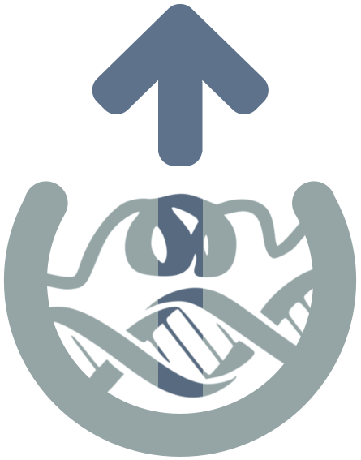

# 3-dimensional structure Representation Sharing

This is the backend of the **3-dimensional structure Representation Sharing (3dRS)** web application.

## Links

[Visit the official website](https://mmb.irbbarcelona.org/3dRS)

[Visit the official documentation]()

## Credits

Genís Bayarri, Adam Hospital.

## Copyright & licensing

This software has been developed by the [MMB group](https://mmb.irbbarcelona.org) at the [IRB Barcelona](https://irbbarcelona.org).

© 2021 **Institute for Research in Biomedicine**

Licensed under the **Apache License 2.0**.

